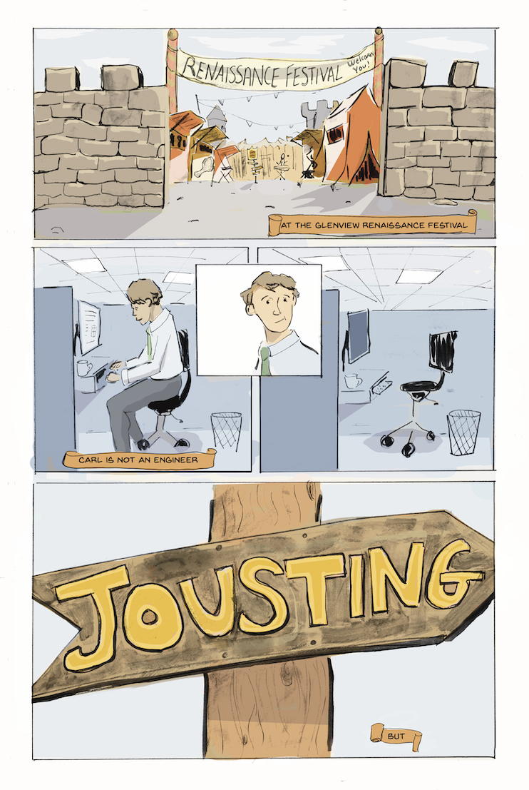

# Sir Damon's Armor Comic Book

My first complete comic book based on a short story I published long ago in the literary journal [HAD](https://www.havehashad.com/hadposts/sir-damon-s-armor).

## Introduction

I wrote this story four years ago because I felt like I had “failed” as a writer.

All year I had written short stories, cleaned them up through multiple revisions, and submitted them to literary magazines only to be rejected. I kept track of each of those submissions on a spreadsheet that turned red whenever it was rejected, and I watched throughout 2020 the whole sheet turn a demoralizing shade of crimson.

So I decided to try something else. For all of October, I drew a new drawing every day based on a prompt word, and for every day in November, I would then write a story about whatever I drew. No submissions. No revisions. Not even show other people because this was going to be a little project just for me.

On my birthday I drew a picture of a knight atop a horse with a pen my friends gave me as a present. A month later I wrote a story about a knight who really wasn’t a knight but played one at a fair.

And then I did nothing with the story because it was just something I did to make me feel more fulfilled as a writer.

Then in 2022, an editor I followed put out a call for free edits of fiction under 500 words. I didn’t have many stories ready to go with that few words, but I did have one from that month that I thought was pretty good…

He sent it back with some notes and more encouragement than I could have asked for.

Two months later, another editor opened his website for submissions, I sent it in, and he accepted it, giving it its first published home.

A few months later, I started learning to use animation software and thought, what if I turned my story into a short movie? I storyboarded the whole thing and cut them together with narration and started to build a 3D set.

But a little idea started to worm its way into my head: what if I made a comic? I love comics. I read them. I watch other people make them. I’ve published a few short, silly ones online. But what if I made a comic book?

And so I did. I worked page-by-page. I thought I was going to watercolor every page like my favorite comic artist, but I realized I didn’t love the final look doing it that way. I learned so many things just by doing it and making little mistakes and trying to fix them and getting to spend another year with these characters and hopefully bring them to life in a new way.

I’m very proud of the book you are holding. I’ve loved every step I’ve taken to get where I am. I hope you will like it too.

-Nathan

